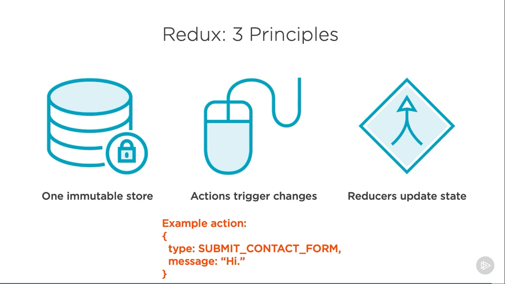
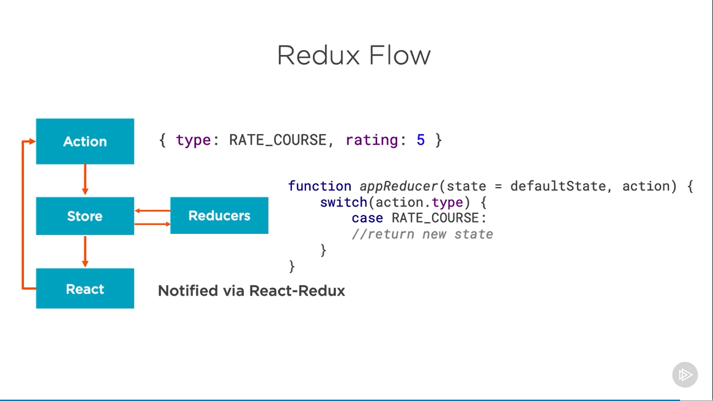

# React-redux

## Why webpack?

Webpack has become the most popular bundler in the React community.  
It's extremely powerful and extensible. We'll use webpack to bundle our compiled JavaScript  
into a single minified file that works in the browser. Webpack also includes a development  
web server, so we'll serve our app locally during development via webpack.

```javascript
// Setting up js environment

const webpack = require("webpack");
const path = require("path");
const HtmlWebpackPlugin = require("html-webpack-plugin");

process.env.NODE_ENV = "development";

module.exports = {
  mode: "development",
  target: "web",
  devtool: "cheap-module-source-map", //There are a number of dev tools to consider,
  // but this one is generally recommended for development so that we get a source map
  // for debugging. source maps let us see our original code in the browser. Because we're
  // going to transpile our code with Babel, source maps will let us see the original code
  // that we wrote when we view it in the browser.
  entry: "./src/index",
  output: {
    path: path.resolve(__dirname, "build"), // we can declare where we want webpack to output.
    // Now this is a little bit strange because webpack doesn't output code in development mode.
    // It merely puts it in memory. However, we do have to declare these paths so that it knows
    // where it's serving from memory.
    publicPath: "/",
    filename: "bundle.js",
  },
  // We're going to use webpack to serve our app in development too, so we're going to configure the devServer right here.
  devServer: {
    stats: "minimal", // This reduces the information that it writes to the command line
    overlay: true, // overlay any errors that occur in the browser
    historyApiFallback: true, // this means that all requests will be sent to index.html
    disableHostCheck: true,
    headers: { "Access-Control-Allow-Origin": "*" },
    https: false,
  },
  plugins: [
    // For plugins, you specify an array. We're going to tell the plugin where to find our HTML template,
    // which is in the src directory in index.html, and also tell it where to find our favicon, which is in that same directory.
    new HtmlWebpackPlugin({
      template: "src/index.html",
      favicon: "src/favicon.ico",
    }),
  ],
  module: {
    // We tell webpack what files we want it to handle, and we do that by declaring an array of rules
    rules: [
      {
        // The first rule is going to be for our JavaScript, so we will tell it how to find our JavaScript files.
        test: /\.(js|jsx)$/,
        exclude: /node_modules/, // ignore node_modules
        use: ["babel-loader", "eslint-loader"], // to run Babel on these files, we will call babel‑loader.
        // So, this little snippet of code will run Babel on all of our JavaScript and webpack will bundle
        // that up for us. These rules work in bottom up approach i.e., run eslint-loader first then babel-loader.
      },
      // Webpack understands a lot more than JavaScript. We can also have it process our CSS.
      {
        test: /(\.css)$/,
        use: ["style-loader", "css-loader"],
      },
    ],
  },
};
```

## Why babel?

Babel transpiles modern JavaScript down to assure that it runs in all browsers  
that you need to support. You tell Babel what browsers you need to support,  
and it transpiles your code as needed.

The second reason we need Babel is to compile our JSX. We can't send it down to  
the browser because JSX isn't valid JavaScript. So Babel will transpile our JSX  
down to JavaScript. If you click on Try it out on the Babel website, you can see  
how Babel transpiles JSX. Note that the browser ultimately just receives calls to  
React.createElement.

## Setting up ESLint in package.json file

```json
"eslintConfig": {
  // Use the recommended setting as
    "extends": [
      "eslint:recommended",
      "plugin:react/recommended",
      "plugin:import/errors",
      "plugin:import/warnings"
    ],
    "parser": "babel-eslint",
    "parserOptions": {
      "ecmaVersion": 2018,
      "sourceType": "module",
      "ecmaFeatures": {
        "jsx": true
      }
    },
    "env": {
      "browser": true,
      "node": true,
      "es6": true,
      "jest": true
    },
    "rules": {
      "no-debugger": "off",
      "no-console": "off",
      "no-unused-vars": "warn",
      "react/prop-types": "warn"
    },
    "settings": {
      "react": {
        "version": "detect"
      }
    },
    "root": true
  }
```

## Benefits of Functional Components

1. Easier to understand
2. Avoid 'this' keyword
3. Less transpiled code - Functional components transpile smaller than class components  
   This leads to smaller bundles, and better performance.


4. High signal-to-noise ratio


5. Enhanced code completion / intellisense
6. Easy to test
7. Performance - Function components offer improved performance as well since as
   of React 16 there's no instance created to wrap them.
8. Classes may be removed in the future.

## When to choose class vs functional components


## Container vs Presentation components

### Container components

Container components are concerned with behavior and marshaling data and actions, so these  
components have little or no markup. You can think of container components as the back end  
for the front end. Remember, components don't have to emit DOM. Container components are mainly  
concerned with passing data and actions down to child components. This means that they're  
typically stateful. When working in Redux, container components are typically created using  
Redux's connect function at the bottom of the file.

Presentation components are dumb. They're nearly all markup. Container components pass data  
and actions, down to presentation components. Presentation components receive functions and  
data that they need from a container component. Container components know about Redux. They  
have Redux‑specific code inside for dispatching actions to the store and connecting to the  
store via Redux's connect function. Presentation components just rely on props to display UI.  
They have no dependencies on the rest of the app, such as Redux actions or stores. Presentation  
components don't specify how the data is loaded or mutated.

**Note**: container components are often stateful. They contain state that they pass down to  
presentation components, whereas presentation components are typically not stateful; they're  
just plain functions.


### When to create container component?

when you find yourself having to update multiple layers of components just to pass data down  
to the child component that actually uses the data, that can be a good time to add some container  
components that connect to the Redux store.


# Redux

## Do I need Redux?

As data flows get more complex, you may find yourself displaying the same data in multiple places.  
You may have a large number of potential state changes that are hard to manage. You may find it helpful  
to handle state changes in a single spot for consistency, testability. At this point, there are two  
popular options to consider, React's built‑in context or React with Redux.

### Problem statement

Imagine this is your app's React component tree. Each circle represents a React component in your app.  
The top circle represents your top‑level app component, which passes data down to these child components  
via props. What if these two components need to work with the same data? They're in very different parts  
of your app. So how can they work with the same data? For example, imagine these components in blue need  
user data. Each could make an API call to retrieve user data from a database, but that could be wasteful  
and redundant. And how would they communicate to assure that the user data that they're using stays in  
sync? There are three popular options to handle this.

### Solution 1 - Prop drilling

In this case, it means moving the user data all the way up to the top‑level component since that's their  
only common ancestor. This is annoying though because it means that you have to pass data down on props  
through all these other components. These components didn't need the user's data. You're just passing the  
data down on props to avoid storing the same data in two spots. We added the user prop to these six  
components merely to pass the data down to the two components that need it.

**Pros and Cons**: lifting state does work, and it's a good first step for small and midsize applications.  
But on larger apps that need to display the same data in many spots, lifting state becomes tedious, and it  
leads to components with many props that exist merely to pass data down.


### Solution 2 - React Context

The second way to solve this problem is to consider React's context. With React's context, you can expose  
global data and functions from a given React component. To access this global data, you import the context  
and consume it in your component. So it's not truly global data. You must explicitly import the context to  
consume it.

For example, the top‑level component could declare a UserContext provider. This provider would provide user  
data and relevant functions to any components that want to consume it. So the two components that need the  
user data can import that UserContext and thus access the user's information via UserContext.Consumer. Since  
context can also expose functions for global usage, the consuming component can also call the createUser  
function that's actually declared way up here in the top‑level component if it's exposed via the UserContext  
provider.


### Solution 3 - Redux

With Redux, there's a centralized store. Think of the store like a local client‑side database. This is a single  
spot where the app's global data is stored. Any component can connect to the Redux store. The Redux store can't  
be changed directly though. Instead, any components can dispatch an action, such as createUser. When the action  
is dispatched, the Redux store is updated to reflect the new data, and any connected components received this  
new data from the Redux store and rerender.


## When is Redux useful?

Redux can be useful for applications that have complex data flows.

1. Need to handle interactions between two components that don't have a parent/child relationship.
2. Find two dispirit components are manipulating the same data. (This scenario is often the case when your application  
   has non‑hierarchical data.)
3. As the application offers an increasing number of actions such as writes, reads, and deletes for complex data structures


**Summary**: The most obvious sign that you'll want something like Redux is if you're utilizing the same data in many  
places. If your components need to utilize the same data and they don't have a simple parent/child relationship.


### Redux three principles



**_The first principle_**:  
Application state is placed in a single immutable store.  
By immutable, I mean that state can't be changed directly. Having one immutable store aids debugging,  
supports server rendering, and it makes things like undo and redo easily possible.

**_The second principle_**:  
The only way to change state is to emit an action, which describes a user's intent. For example, a user  
might click the Submit Contact Form button, and that would trigger a SUBMIT_CONTACT_FORM action.

**_The third principle_**:
State changes are handled by pure functions. These functions are called reducers.  
In Redux, a reducer is just a function that accepts the current state in an action, and it returns a new state

## Redux Flow - High level



1. Actions, reducers, the store, and container components all interact to create unidirectional data flows in Redux.
2. An action describes a user's intent. It's an object with a type property and some data. The data portion can  
   be whatever shape you like. The only requirement is that an action has a type property.
3. **_Example_**: Here's an action for rating a course. Imagine that you were rating my course on a scale of 1 to 5.  
   if you did click to rate it as a 5‑star course, then this is the action that would be produced. To data/payload, we  
   can pass multiple separate pieces of data here or just one or more separate objects. This action will ultimately  
   be handled by a reducer.

   A reducer is a fancy name for a function that returns new state based on the action that you pass it.  
   So as you can see, the reducer receives the current state and an action, and then it returns a new state.

4. Reducers typically contain a switch statement that checks the type of action passed. This determines what new state  
   should be returned. Once this new state is returned from a reducer, the store is updated. React rerenders any  
   components that are utilizing the data.

# Redux deeper

## Actions


In Redux, the events happening in the application are called actions. Actions are just plain objects containing a description  
of an event.  
An action must have a type property. The rest of its shape is up to you. Here I'm passing some data under a property called  
rating. This could be a complex object, a simple number, a Boolean, or really any value that's serializable. The only thing  
that you shouldn't try passing around in your actions are things that won't serialize to JSON, like functions or promises.


Actions are typically created by convenience functions that are called action creators. Here's an action creator called RATE_COURSE.  
Typically, the action creator has the same name as the action's type. Action creators are considered convenience functions because  
they're not required, but follow this simple convention. By using these action creators to create your actions, the spot where you  
dispatch the action doesn't need to know about the action creator structure.

## Redux Store


In Redux, you create a store by calling createStore in your app's entry point. You pass the createStore function to your reducer  
function. The Redux store honors the single responsibility principle because the store simply stores the data, while reducers,  
which we'll discuss in a moment, handle state changes.


**_Concerned about the only one store_** -> this is a key feature. Having a single source of truth makes  
the app easier to manage and understand.

The store can dispatch an action, subscribe to a listener, return its current state, and replace a reducer. This last feature is  
useful to support hot reloading. The most interesting omission here is that there's no API for changing data in the store and that's  
a good thing. It means that the only way that you can change the store is by dispatching an action.

Store can't be changed directly. The store doesn't actually handle the actions that you dispatch, actions are handled by reducers.

## Immutability and Why we choose immutability?

**_Refer PDF_** -> Immutability

**_Why Immutability?_**

1. Clarity -> First, immutability means clarity. In many application architectures, If you think where did that state  
   change? What line of code just changed that value from 0 to 1? Redux's centralized immutable store means that I no longer ask myself  
   these silly and time‑consuming questions. When state is updated, I know exactly where and how it happened. I just tell myself it was  
   in the reducer.  
   When state changes in a Redux app, you know where it occurred. You know someone wrote some code in a reducer that returned a new copy  
   of state, because it means that you're clear about what file to open to actually see state changing.  
   In traditional apps, many files could potentially be manipulating state. In Redux, you don't have to wonder where the state update  
   occurred. As long as you're using Redux to handle your state, then you know that it occurred in your reducer.

   

2. Performance -> To understand why immutable state is so useful for performance, imagine that we have a large state object with many  
   properties. If state were immutable, Redux would have to do an expensive operation to determine if state has changed. It would have to  
   check every single property on your state object to determine if any state had changed. But if state is immutable, suddenly this  
   expensive operation of checking every single property is no longer necessary.  
   Instead, Redux can simply do a reference comparison. (`if(previousStoreState !== storeState)...`) If the old state isn't referencing  
   the same object in memory, then we know that the state has changed. This is extremely efficient. And behind the scenes, React‑Redux  
   can use this simple reference comparison to determine when to notify React of state changes. It won't rerender the component if  
   nothing has changed. So immutability doesn't just make your app more predictable and easier to think about. It also helps improve  
   performance.

   

3. Awesome Sauce


## Reducers

To change the store, you dispatch an action that is ultimately handled by a reducer. A reducer is actually quite simple. It's a function  
that takes state in an action and returns new state.


Reducers must be pure functions. This means that they should produce no side effects. You know you have a pure function if calling it with  
the same set of arguments always returns the same value. Because reducers are supposed to be pure functions, there are three things that  
you should never do in a reducer. You should never mutate arguments, you should never perform side effects like API calls or routing  
transitions, and should never call non‑pure functions. A reducer's return value should depend solely on the values of its parameters, and  
it should call no other non‑pure functions, such as date.now or math.random.

Remember, instead of mutating state, you return a copy of what was passed in and Redux will use that to create the new store state.


One might think that having one store would be limiting and lead to huge, monolithic stores that are hard to manage in practice, it's not a  
problem. You can manage slices of your state changes through multiple reducers in Redux. When a store is created, Redux calls the reducers  
and uses their return values as initial state, but you might wonder if we have multiple reducers, which one is called when an action is  
dispatched. Well, the answer is all of them. All reducers get called when an action is dispatched. The switch statement inside each reducer  
looks at the action type to determine if it has anything to do. This is why all reducers should return the untouched state as the default.  
This way, if no case matches the action type past, the existing state is returned. So, for example, if I dispatch the DELETE_COURSE action  
and my app has three reducers, one for courses, one for authors, and one that handles loading status, all three of these reducers will be  
called, but only the reducer that actually handles the DELETE_COURSE action type will do anything. The others will simply return the state  
that was passed to them.

Remember all the reducers together form the complete picture of what's in the store.

One might wonder if there is always a one to one mapping between reducers and actions. Nope. The Redux docs recommend using reducer  
composition. This means a given action can be handled by more than one reducer. Bottom line, remember, each action can be handled by one or  
more reducers and each reducer can handle one or more actions.

## Look at normalizing state shape

[Normalizing state shape](https://redux.js.org/usage/structuring-reducers/normalizing-state-shape)

## Redux flow and setup


## To handle Async operations in React-redux application - Redux-thunk


## Why Redux-thunk?


**_Thunk_**: A function that wraps an expression to delay its evaluation.

Example

```javascript
export function deleteAuthor(authorId) {
  return (dispatch, getState) => {
    return AuthorApi.deleteAuthor(authorId)
      .then(() => {
        dispatch(deletedAuthor(authorId));
      })
      .catch(handleError);
  };
}
```

[redux-thunk](https://redux.js.org/usage/writing-logic-thunks) -> Read this
